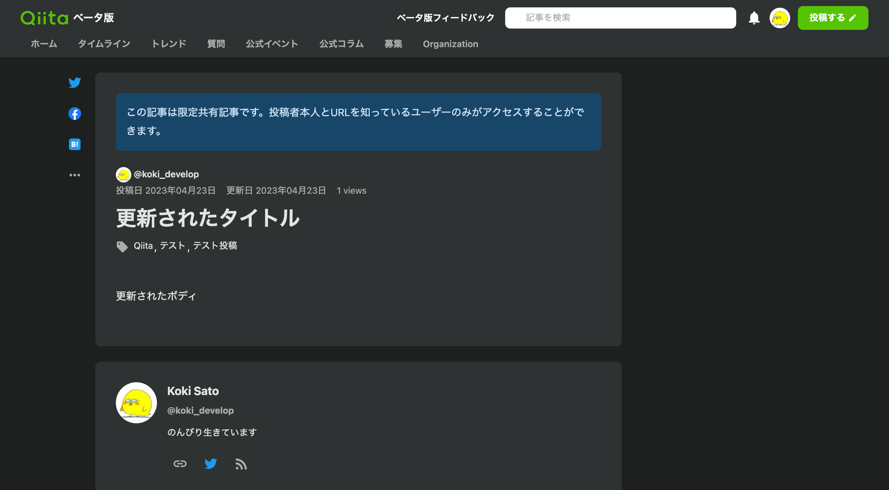

# 記事を作成 / 更新 / 削除する

## 目次

- [記事を作成](#記事を作成)
- [記事を更新](#記事を更新)
- [記事を削除](#記事を削除)

## 記事を作成

> **Note**  
> `push` コマンドを使用してマークダウンファイルから記事を作成することもできます。  
> 詳しくは「[マークダウンファイルで記事を管理する](../file/README.md)」をご参照ください。

`qiita items create` で記事を作成することができます。

次のコマンドを実行して記事を作成してみましょう。  
テスト投稿なので `--private` フラグを指定して限定共有記事にしておきます。

```sh
$ qiita items create \
    --title 'テスト投稿' \
    --tags 'Qiita,テスト投稿' \
    --body 'これはテスト投稿です。' \
    --private
```

実際に [Qiita](https://qiita.com) で記事が作成されていることが確認できます。


さらに詳しい使い方についてはヘルプをご参照ください。

```sh
$ qiita items create --help
```

## 記事を更新

> **Note**  
> `push` コマンドを使用してマークダウンファイルから記事を更新することもできます。  
> 詳しくは「[マークダウンファイルで記事を管理する](../file/README.md)」をご参照ください。

`qiita items update` で記事を更新することができます。

次のコマンドを実行して記事を更新してみましょう。  
`<記事のID>` はテスト投稿の記事の ID に置き換えてください。

```sh
$ qiita items update <記事のID> \
    --title '更新されたタイトル' \
    --tags 'Qiita,テスト投稿,テスト' \
    --body '更新されたボディ'
```

実際に [Qiita](https://qiita.com) で記事が更新されていることが確認できます。



さらに詳しい使い方についてはヘルプをご参照ください。

```sh
$ qiita items update --help
```

## 記事を削除

`qiita items delete` で記事を削除することができます。

次のコマンドを実行して記事を削除してみましょう。  
`<記事のID>` はテスト投稿の記事の ID に置き換えてください。

```sh
$ qiita items delete <記事のID>
```

実際に [Qiita](https://qiita.com) で記事が削除されていることが確認できます。

さらに詳しい使い方についてはヘルプをご参照ください。

```sh
$ qiita items delete --help
```
