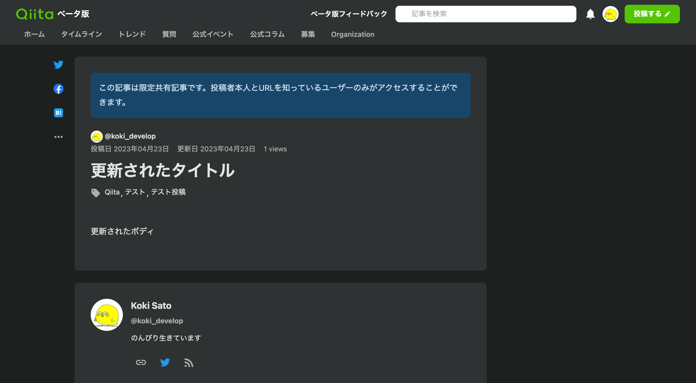

# マークダウンファイルで記事を管理する

Qiita CLI は静的なマークダウンファイルで記事を作成 / 更新することができます。  
また、すでに作成済みの記事を一括でローカルにダウンロードすることもできます。

- [記事を作成](#記事を作成)
- [記事を更新](#記事を更新)
- [既存の記事をダウンロードする](#既存の記事をダウンロードする)

## 記事を作成

まずは `qiita items new` を次のように実行します。  
テスト投稿なので `--private` フラグを指定して限定共有記事にしておきます。

```sh
$ qiita items new 'test' --private
```

すると `test.md` というファイルが次のような内容で作成されます。

```md
---
title: ""
tags: []
private: true
---

```

それでは任意のエディタを使用して `test.md` を編集します。  
今回は次のように書き換えてみます。

```md
---
title: テスト投稿
tags: [Qiita, テスト投稿]
private: true
---

これはテスト投稿です。
```

最後に `qiita items push` を次のように実行すると記事を作成することができます。  
`--write` フラグを指定すると ID などのメタ情報がファイルに書き込まれます。

```sh
$ qiita items push ./test.md --write
```

実際に [Qiita](https://qiita.com) で記事が作成されていることが確認できます。


また、 `test.md` に記事の ID が書き込まれていることが確認できます。

```md
---
id: xxxxxxxxxxxxxxxxxxxx
title: テスト投稿
tags: [Qiita, テスト投稿]
private: true
---

これはテスト投稿です。
```

## 記事を更新

「[記事を作成](#記事を作成)」で作成した `test.md` を使用して記事を更新してみましょう。

`test.md` を次のように書き換えます。

```md
---
id: xxxxxxxxxxxxxxxxxxxx
title: 更新されたタイトル
tags: [Qiita, テスト投稿, テスト]
private: true
---

更新されたボディ
```

最後に `qiita items push` を次のように実行すると記事を更新することができます。  

```sh
$ qiita items update ./test.md --write
```

実際に [Qiita](https://qiita.com) で記事が更新されていることが確認できます。



## 既存の記事をダウンロードする

`qiita items pull` を使用するとすでに作成済みの記事をダウンロードすることができます。  
次のように実行してみましょう。

```sh
$ qiita items pull --all --out ./items
```

すると全ての自分の記事が `./items/<記事のタイトル>.md` という名前でマークダウン形式で保存されます。  
その後は `qiita items update` などを使用して記事をマークダウンファイルで管理することができます。
